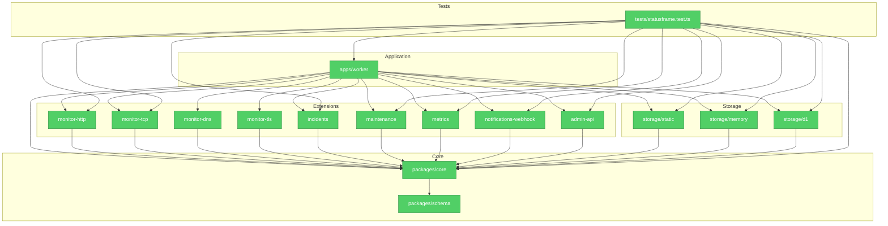

# Architecture Audit

Mode: Architecture Audit

## Module Dependency Graph

## Findings

No critical or warning-level architecture decay was found after the refactor.

### Dependency Direction

Symptom: Core has no imports from Worker, storage packages, or extension packages.

Source: `packages/core` depends only on `packages/schema` and internal Core modules.

Consequence: Official extensions and third-party extensions can evolve without forcing Core to know their concrete implementation details.

Remedy: Keep this as the project rule. New extensions should depend on `@statusframe/core`; Core should not import them.

### Extension Boundary

Symptom: HTTP, TCP, incident, maintenance, metrics, notifications, and admin behavior are registered through `StatusFrameExtension`.

Source: `apps/worker/src/index.ts` composes extensions at build time; `packages/core/src/runner.ts` invokes only generic hooks.

Consequence: The design rule that extension boundaries are not Worker invocation boundaries is preserved.

Remedy: Continue adding features as extension packages and register them in the Worker composition layer.

### Public Safety

Symptom: Public routes render `PublicSnapshot` and never return raw monitor state.

Source: `runner.getPublicSnapshot`, `generatePublicSnapshot`, and `assertPublicOutput` are the route-facing path.

Consequence: Monitor targets, raw errors, private IPs, webhook URLs, and token-like strings are kept out of public responses by construction and tests.

Remedy: Any new public route should either return `PublicSnapshot` data or run `validatePublicOutput` on its response model.

### Testability

Symptom: Network and storage dependencies are injectable.

Source: Runner accepts `fetch`, `TcpConnector`, and `StorageAdapter`; D1 is isolated behind `createD1Storage`.

Consequence: Core behavior can be tested without real Cloudflare network or D1 bindings.

Remedy: Preserve injection points when adding DNS/TLS implementations, external providers, or richer admin actions.

## Remaining Deliberate Gaps

- DNS and TLS monitor packages are scaffolds.
- Admin API has authenticated validation and snapshot regeneration, but not full CRUD.
- D1 storage covers snapshots and current state; full incident and maintenance persistence remains future extension work.

These are documented in `docs/implementation-status.md` so `DESIGN.md` and `goal.md` can be removed without losing planning context.
